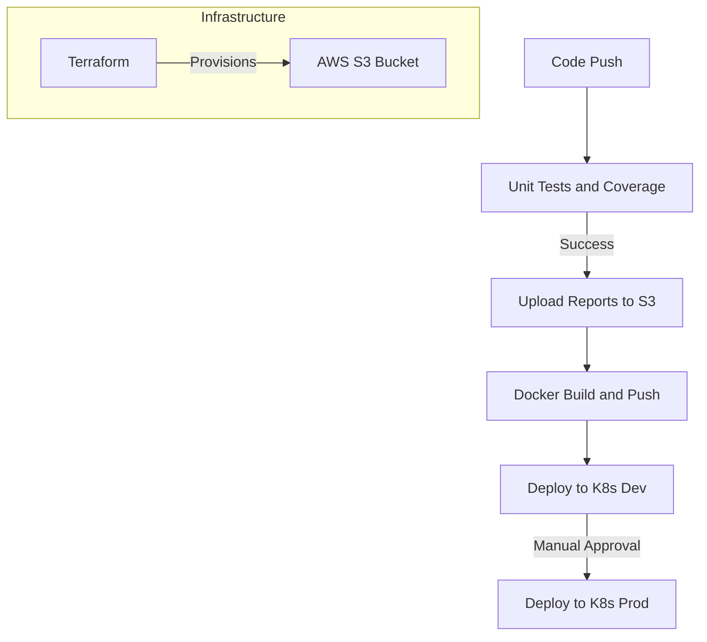

# 🪐 Solar System: Node.js Microservice with Advanced CI/CD


A production-ready Node.js microservice showcasing a complete **DevOps Lifecycle**. This project features a robust CI/CD pipeline using **GitHub Actions**, **Unit Testing with Code Coverage**, **Terraform** for infrastructure provisioning, and deployment to **Kubernetes** across multiple environments.

---

## 🚀 DevOps Architecture & Pipeline

The CI/CD pipeline ensures code quality and seamless deployment using a reusable workflow strategy:


 
### Key Features
- **Advanced CI/CD**: Modularized build process with GitHub Actions reusable workflows.
- **Custom Actions**: Local composite action (`npm-action`) for efficient dependency setup.
- **Code Quality**: Integrated Unit Testing (Mocha/Jest) and Code Coverage (nyc).
- **Infrastructure as Code**: Terraform-managed AWS S3 buckets for build artifacts and reports.
- **GitOps Strategy**: Separate Kubernetes manifests for development and production environments.
- **Ingress Controller**: Configured `ingress.yaml` for traffic routing within the cluster.

---

## 📂 Project Structure

```plaintext
.
├── .github/
│   ├── npm-action/         # Custom Composite Action
│   └── workflows/          # CI/CD Pipelines
│       ├── solar-system.yml
│       └── reuse-workflow.yml
├── kubernetes/             # K8s Manifests
│   ├── development/        # Dev Environment Configs
│   ├── production/         # Prod Environment Configs
│   └── ingress.yaml        # Ingress Routing
├── terraform/              # Infrastructure
│   └── s3-reports.tf       # S3 Bucket for Test Reports
├── coverage/               # Test Coverage Reports
├── app.js                  # Main Application Entry Point
├── Dockerfile              # Container Specification
└── package.json            # Dependencies & Scripts
```

---

## 🛠 Prerequisites

Ensure the following tools are installed:

- **Node.js** (v18+)
- **Docker**
- **Kubectl** (configured for your cluster)
- **Terraform**
- **AWS CLI** (for S3 interaction)

---

## ⚙️ Workflow Breakdown

### 1. Continuous Integration (CI)
Triggered on every push:
- Installs dependencies via the custom action.
- Runs Unit Tests (`npm test`).
- Generates Code Coverage.
- Uploads coverage reports to AWS S3 (provisioned by Terraform).

### 2. Continuous Delivery (CD)
If CI passes:
- Builds the Docker image.
- Pushes to a container registry (Docker Hub/ECR).
- **Dev Deployment**: Automatically updates the Kubernetes development namespace.
- **Prod Deployment**: Requires manual approval or tag creation for production updates.

---

## 🚀 How to Run Locally

### 1. Provision Infrastructure
Set up the S3 bucket for reports:
```bash
cd terraform
terraform init
terraform apply
```

### 2. Run with Docker
```bash
docker build -t solar-system:local .
docker run -p 3000:3000 solar-system:local
```

### 3. Deploy to Kubernetes (Manually)
```bash
# Deploy to Development
kubectl apply -f kubernetes/development/
kubectl apply -f kubernetes/ingress.yaml

# Verify Pods
kubectl get pods -n development
```

---

## 🧪 Testing

Run unit tests and generate a coverage report locally:
```bash
npm install
npm test
# Coverage report will be generated in the /coverage folder
```

--- 

🎉 **Happy Coding!**